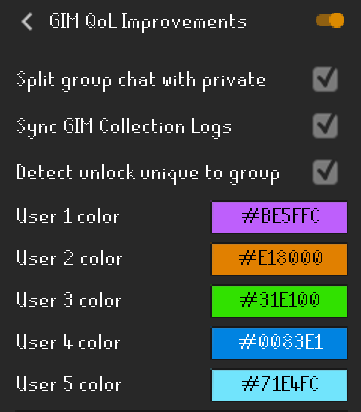

# GIM Improve Plugin
A [Runelite](https://github.com/runelite/runelite) plugin that adds Group Ironm Man Quality of Life Improvements - puts GIM chat into PMs and GIM collection log visual indicators

## Features
Color coordinated dot indicators items unlocked by teammates:

Tooltip overlay describing which teammates already unlocked the item:

## Config

`Split group chat with private` - if you have split private chat enabled (via Runescape default settings), the group chat messages will also be added to the private split chat.

`Sync GIM collection Logs` - pull data from [collectionlog.net](https://collectionlog.net) to for getting teammate's
collection log data. Use [Collection Log Plugin](https://runelite.net/plugin-hub/show/collection-log) to upload
collection log data. If the user doesn't have data in [collectionlog.net](https://collectionlog.net), this feature will
not work.

`detect unlock unique to group` - in game chat will indicate if a unique drop you receive is unique to the group.

Assign `Colors` to teammates for dot indicators:

